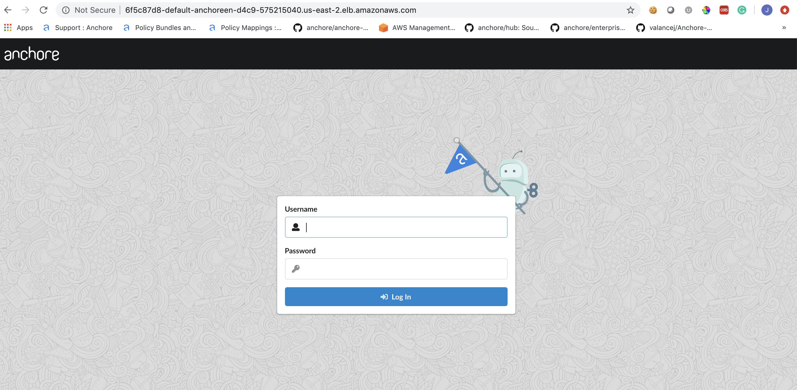
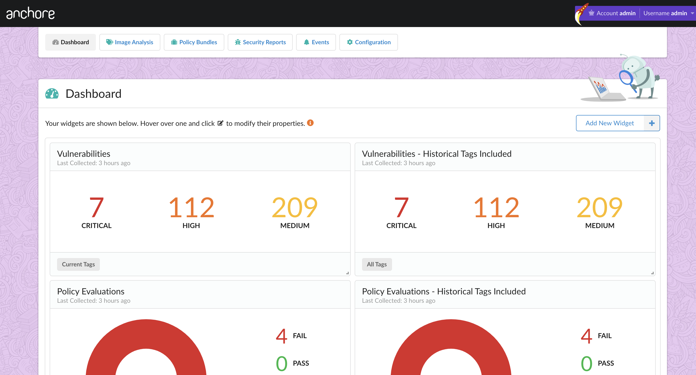

# Anchore Enterprise EKS Installation

The purpose of this document is to walkthrough the installation of Anchore Enterprise on EKS with Helm. Anchore currently maintains a [Helm Chart](https://github.com/helm/charts/tree/master/stable/anchore-engine) which I will use to install the necessary Anchore components. 

## Prerequisites

- A running Amazon EKS cluster with worker nodes launched. See [EKS Documentation](https://docs.aws.amazon.com/eks/latest/userguide/getting-started.html)for more information.
- [Helm](https://helm.sh/) client and server installed and configured to your EKS cluster.

**Note:** We've written a blog post titled [Introduction to Amazon EKS](https://anchore.com/introduction-to-amazon-eks/) which details how to get started on the above prerequisites.

The prerequisites for getting up and running are the most difficult part of the installation in my opinion, the Anchore Helm chart makes the installation process straightforward. 

Once you have a EKS cluster up and running and worker nodes launched, you can verify via the following command:

```
$ kubectl get nodes
NAME                                       STATUS    ROLES     AGE       VERSION
ip-10-0-1-66.us-east-2.compute.internal    Ready     <none>    1d        v1.12.7
ip-10-0-3-15.us-east-2.compute.internal    Ready     <none>    1d        v1.12.7
ip-10-0-3-157.us-east-2.compute.internal   Ready     <none>    1d        v1.12.7
```

### Anchore Helm Chart Configuration

To make proper configurations to the Helm chart, create a custom `anchore_values.yaml` file and utilize it when installing. There are many options for configuration with Anchore, for the purposes of this document, I will only change the minimum to get Anchore Enterprise installed. For reference, there is an anchore_values.yaml` [file](anchore_values.yaml) in this repository, that you may include in your installation. 

**Note:** For this installation, I will be configuring ingress and using an ALB ingress controller. You can read more about [Kubernetes Ingress with AWS ALB Ingress Controller](https://aws.amazon.com/blogs/opensource/kubernetes-ingress-aws-alb-ingress-controller/).

#### Configurations

##### Ingress

I've added the following to my `anchore_values.yaml` file under the ingress section:

```
ingress:
  enabled: true
  # Use the following paths for GCE/ALB ingress controller
  apiPath: /v1/*
  uiPath: /*
    # apiPath: /v1/
    # uiPath: /
    # Uncomment the following lines to bind on specific hostnames
    # apiHosts:
    #   - anchore-api.example.com
    # uiHosts:
    #   - anchore-ui.example.com
  annotations:
    kubernetes.io/ingress.class: alb
    alb.ingress.kubernetes.io/scheme: internet-facing
```

##### Anchore Engine API service

I've added the following to my `anchore_values.yaml` file under the Anchore API section:

```
# Pod configuration for the anchore engine api service.
anchoreApi:
  replicaCount: 1

  # Set extra environment variables. These will be set on all api containers.
  extraEnv: []
    # - name: foo
    #   value: bar

  # kubernetes service configuration for anchore external API
  service:
    type: NodePort
    port: 8228
    annotations: {}
```

**Note:** Changed service type to NodePort.

##### Anchore Enterprise Global

I've added the following to my `anchore_values.yaml` file under the Anchore Enterprise global section:

```
anchoreEnterpriseGlobal:
  enabled: true
```

**Note:** Enabled enterprise components.

##### Anchore Enterprise UI

I've added the following to my `anchore_values.yaml` file under the Anchore Enterprise UI section:

```
anchoreEnterpriseUi:
  # kubernetes service configuration for anchore UI
  service:
    type: NodePort
    port: 80
    annotations: {}
    sessionAffinity: ClientIP
```

**Note:** Changed service type to NodePort.

This should be all you need to change in the chart. 

#### AWS EKS Configurations

Download the ALB Ingress manifest update cluster-name with EKS cluster name in alb-ingress-controller.yaml

`wget https://raw.githubusercontent.com/kubernetes-sigs/aws-alb-ingress-controller/v1.0.1/docs/examples/alb-ingress-controller.yaml`

Update cluster-name with the EKS cluster name in alb-ingress-controller.yaml

`wget https://raw.githubusercontent.com/kubernetes-sigs/aws-alb-ingress-controller/v1.0.1/docs/examples/rbac-role.yaml`

From the AWS console, create an IAM policy and manually update the EKS subnets for auto discovery.

In the IAM console, create a policy using the contents of the template [iam-policy.json](https://raw.githubusercontent.com/kubernetes-sigs/aws-alb-ingress-controller/v1.0.0/docs/examples/iam-policy.json). Attach the IAM policy to the EKS worker nodes role.

Add the following to tags to your clusters public subnets:

```
kubernetes.io/cluster/demo-eks-cluster : shared
kubernetes.io/role/elb : ''
kubernetes.io/role/internal-elb : ''
```

Deploy the rbac-role and alb ingress controller.

`kubectl apply -f rbac-role.yaml`

`kubectl apply -f alb-ingress-controller.yaml`

#### Deploy Anchore Enterprise

Enterprise services require an Anchore Enterprise license, as well as credentials with permission to the private docker repositories that contain the enterprise images.

Create a kubernetes secret containing your license file.

`kubectl create secret generic anchore-enterprise-license --from-file=license.yaml=<PATH/TO/LICENSE.YAML>`

Create a kubernetes secret containing dockerhub credentials with access to the private anchore enterprise repositories.

`kubectl create secret docker-registry anchore-enterprise-pullcreds --docker-server=docker.io --docker-username=<DOCKERHUB_USER> --docker-password=<DOCKERHUB_PASSWORD> --docker-email=<EMAIL_ADDRESS>`

Run the following command to deploy Anchore Enterprise:

`helm install --name anchore-enterprise stable/anchore-engine -f anchore_values.yaml`

It will take the system several minutes to bootstrap. You can checks on the status of the pods by running `kubectl get pods`

```
MacBook-Pro-109:anchoreEks jvalance$ kubectl get pods
NAME                                                              READY     STATUS    RESTARTS   AGE
anchore-cli-5f4d697985-hhw5b                                      1/1       Unknown   0          4h
anchore-cli-5f4d697985-rdm9f                                      1/1       Running   0          14m
anchore-enterprise-anchore-engine-analyzer-55f6dd766f-qxp9m       1/1       Running   0          9m
anchore-enterprise-anchore-engine-api-bcd54c574-bx8sq             4/4       Running   0          9m
anchore-enterprise-anchore-engine-catalog-ddd45985b-l5nfn         1/1       Running   0          9m
anchore-enterprise-anchore-engine-enterprise-feeds-786b6cd9mw9l   1/1       Running   0          9m
anchore-enterprise-anchore-engine-enterprise-ui-758f85c859t2kqt   1/1       Running   0          9m
anchore-enterprise-anchore-engine-policy-846647f56b-5qk7f         1/1       Running   0          9m
anchore-enterprise-anchore-engine-simplequeue-85fbd57559-c6lqq    1/1       Running   0          9m
anchore-enterprise-anchore-feeds-db-668969c784-6f556              1/1       Running   0          9m
anchore-enterprise-anchore-ui-redis-master-0                      1/1       Running   0          9m
anchore-enterprise-postgresql-86d56f7bf8-nx6mw                    1/1       Running   0          9m
```

Run the following command for details on the deployed ingress resource: 

```
MacBook-Pro-109:anchoreEks jvalance$ kubectl describe ingress
Name:             anchore-enterprise-anchore-engine
Namespace:        default
Address:          6f5c87d8-default-anchoreen-d4c9-575215040.us-east-2.elb.amazonaws.com
Default backend:  default-http-backend:80 (<none>)
Rules:
  Host  Path  Backends
  ----  ----  --------
  *     
        /v1/*   anchore-enterprise-anchore-engine-api:8228 (<none>)
        /*      anchore-enterprise-anchore-engine-enterprise-ui:80 (<none>)
Annotations:
  alb.ingress.kubernetes.io/scheme:  internet-facing
  kubernetes.io/ingress.class:       alb
Events:
  Type    Reason  Age   From                    Message
  ----    ------  ----  ----                    -------
  Normal  CREATE  18m   alb-ingress-controller  LoadBalancer 6f5c87d8-default-anchoreen-d4c9 created, ARN: arn:aws:elasticloadbalancing:us-east-2:472757763459:loadbalancer/app/6f5c87d8-default-anchoreen-d4c9/42defe8939465e2c
  Normal  CREATE  18m   alb-ingress-controller  rule 2 created with conditions [{    Field: "path-pattern",    Values: ["/*"]  }]
  Normal  CREATE  18m   alb-ingress-controller  rule 1 created with conditions [{    Field: "path-pattern",    Values: ["/v1/*"]  }]
```

I can see above that an ELB has been created and I can navigate to the specified address: 



Once I login to the UI and begin to analyze images, I can see the following vulnerability and policy evaluation metrics displaying on the dashboard. 

